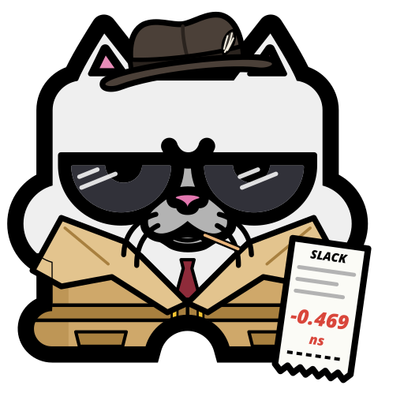
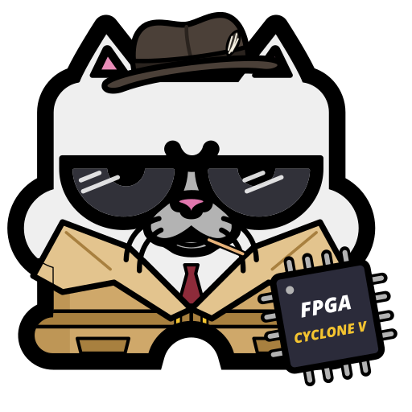

<p align="center"></p>

**Psst… wanna buy a seed?** MiSTer Seedy is a GitHub Actions template for MiSTer core developers. It
answers the question reviewers ask before merging: *does this change make timing closure worse?*

It compiles your core with Quartus across many fitter seeds, for both the PR and its baseline (`master`). It
collects every metric Quartus reports and compares the two populations with honest statistics. Then it posts the
table reviewers already accept: Quality of Fit, f(MAX) geomean, worst-case slacks, ALMs and compile time, as in
the 30-seed DSE tables on [SNES_MiSTer #462](https://github.com/MiSTer-devel/SNES_MiSTer/pull/462). It
also picks the **best seed**, hands you its `.rbf` for hardware testing, and can commit that seed to your `.qsf`.

For cores where closing timing at all is the hard part (Saturn, PSX), **hunt mode** keeps trying seeds until
enough of them meet timing.

##  What you get

A PR comment like this, regenerated on every push to a PR that carries the `seedy` label. The numbers are real:
the SNES INITRAM change (75f10d3) against master (c61bfd4), 30 seeds each, rendered by `seedy render` from the
[golden fixture](tests/fixtures/snes-2026-10-02/) (abridged).

> **Seedy — SNES: this PR @ 75f10d3 vs master @ c61bfd4**
>
> **No measurable regression** · Quartus 17.0.2 Lite · 30 seeds each
>
> Timing closed on 3 of 30 seeds of this PR, against 6 of 30 on master. With 30 seeds a difference that size can be chance (p = 0.47). The seed in the `.qsf` (1) does not close timing on this PR (worst setup −0.898 ns, hold +0.076 ns).
>
> |  | master | this PR | Δ | p |
> |---|---|---|---|---|
> | Seeds that close timing | 6/30 | 3/30 | −3 | 0.47 |
> | Worst setup slack (ns), average / typical seed | −0.469 / −0.403 | −0.341 / −0.275 | +0.128 / +0.128 | 0.29 |
> | Worst setup slack (ns), unluckiest seed | −1.507 | −1.674 | −0.167 |  |
> | Seeds with a hold violation | 5/30 | 8/30 | +3 | 0.53 |
> | Logic used (ALMs), average | 35,116 | 34,939 | −177 | < 0.001 |
> | The `.qsf`'s seed (1): setup / hold (ns) | −0.515 / +0.021 ✗ | −0.898 / +0.076 ✗ | −0.383 / +0.055 |  |
>
> | clock failing setup | seeds (base) | seeds (PR) | Δ | typical slack (base) | typical slack (PR) | Δ | unluckiest (base) | unluckiest (PR) | p |
> |---|---|---|---|---|---|---|---|---|---|
> | `emu c0` | 21/30 | 14/30 | −7 | −0.269 | +0.009 | +0.277 | −1.407 | −1.374 | 0.12 |
> | `emu c2` | 17/30 | 15/30 | −2 | −0.061 | −0.057 | +0.004 | −1.507 | −1.674 | 0.80 |
> | `pll_hdmi c0` | 11/30 | 13/30 | +2 | +0.057 | +0.072 | +0.015 | −0.483 | −0.387 | 0.79 |
>
> - Watched registers `*ramimg*`: worst setup …, hold …, never on a failing path. *(with `watch_registers` set)*
>
> **Recommended seed for hardware testing: 18** (meets timing; worst slack +0.078 ns).
>
> - Its `.rbf` is in the `seedy-rbf` artifact; that exact bitstream is what was measured.
> - The `.qsf`'s seed 1 does not meet timing (worst slack −0.898 ns).
>
> ▸ Top 5 seeds ▸ How to read this ▸ Statistics (all metrics) ▸ Per-seed table (60 rows) ▸ Per-clock setup slack ▸ f(MAX) per clock ▸ Utilization ▸ Runtime ▸ Failing endpoints

The verdict is deliberately conservative. Seedy never says "safe". It says *"No measurable regression"* or
*"Possible regression: …"* and names the metric, the effect size and the p-value. In the comment above, recovery
slack shifted with p = 0.04, but every seed kept more than 2.5 ns of recovery margin, so Seedy notes the shift and
does not flag it. The run also uploads every number as CSV and JSON (`seedy-results`), and every seed's full Quartus logs and text reports as one `.tar.xz` per seed (`seedy-reports`, 14 days), so a run can be re-examined later. The
[metrics guide](docs/METRICS.md) explains each column and where Quartus reports it.

##  Add it to your core

Seedy needs no Quartus install and no changes to your core's sources.

1. **Copy two files** into your core repo:
   [`templates/seedy.yml`](templates/seedy.yml) → `.github/workflows/seedy.yml` and
   [`templates/seedy-report.yml`](templates/seedy-report.yml) → `.github/workflows/seedy-report.yml`.
2. **Create a label** named `seedy` (Issues → Labels → New label).
3. **Merge both files to your default branch.** GitHub runs `workflow_run` workflows (the PR comment poster)
   only from the default branch.

That's it. The Quartus project is auto-detected: the single `*.qpf` at the repo root, ignoring `*_Q13`
revisions. A core with several projects sets `project:` and `revision:` in the `with:` block.

Things you might set in `.github/workflows/seedy.yml`, under `with:`:

```yaml
    with:
      watch_registers: |          # "is the new logic on the critical path?" (reviewers' first question)
        *ramimg*
      thresholds: |               # optional: turn the check red (default is report-only)
        forbid_new_failing_clock: true
        max_median_setup_drop_ns: 0.15
```

> [!NOTE]
> The templates follow `mcfbytes/Seedy_MiSTer@master`. For stable CI, pin a release tag or commit SHA instead:
> change `@master` on the `uses:` lines and pass the same value as `seedy_ref`, so the scripts match the workflow.

##  Running it

A 30-seed comparison is about 60 compiles, so it never runs on its own. You start it in one of two ways.

**On a PR.** Add the `seedy` label. Each later push to that PR re-runs it, and a new push cancels a stale run.
Adding any other label doesn't restart it. Remove the label to stop the re-runs.

**On demand.** Actions → **Seedy** → **Run workflow**, on any branch:

| input | default | what it does |
|---|---|---|
| `mode` | `compare` | `compare`: this branch vs `baseline_ref`. `hunt`: search for seeds that meet timing (below). |
| `seed_count` | `30` | compare: seeds 1..N per variant. 30 matches the #462 precedent; 8–16 is a cheap preview. |
| `baseline_ref` | default branch | compare: branch, tag or SHA to compare against. |
| `max_seeds` / `min_met` / `seed_start` | `100` / `1` / `1` | hunt: how far to search and when to stop. |
| `quartus_version` | `17.0.2` | the MiSTer standard. `17.0`, `17.1`, `18.0`, `18.1` and `19.1` exist for experiments; never mix versions in one comparison. |
| `override_seed` | `never` | `if-failing` / `always`: commit the best seed to this branch's `.qsf` (below). |

A manual run on the default branch itself (or the optional `push:` trigger in the template) compiles just
that commit and caches it as the baseline. Later PR runs against that commit compile only the PR, which halves
their cost. Cached baselines live on a `seedy-data` branch. Only trusted runs write it, never PR runs.

The reusable workflow has more knobs: `shards`, `per_job_concurrency`, `threads_per_compile`, `worst_paths`,
`keep_rbf`, `keep_reports`, `compile_peak_gb`, `compile_timeout` and `baseline_cache`. Each one is documented in
[`.github/workflows/seedy.yml`](.github/workflows/seedy.yml).

##  Hunt mode: cores that barely close

On some cores (Saturn and PSX are the usual suspects) most seeds fail timing. The useful question there is
*"which seed closes?"*, not *"is the PR worse than master?"*. Hunt mode compiles only your branch:

* It walks seeds `seed_start … seed_start + max_seeds − 1`, and stops early once `min_met` seeds meet timing.
* It never starts a compile that would overrun `hunt_minutes` (GitHub-hosted jobs die at 6 h). When the hunt ends
  without enough seeds, the report gives the `seed_start` for the next run. That is the first seed past this
  run's range, so no seed is compiled twice. Seeds are interchangeable random draws, so any seeds this run
  never started are no better than new ones.
* If no seed meets timing, you still get the **closest** seeds, ranked by worst slack and then total negative
  slack. You also get the clocks that fail and how often, and the endpoints that keep failing. That is the
  to-do list for fixing the design rather than rolling more dice.
* With `override_seed: if-failing`, a hunt that finds a closing seed commits it, unless the hunt showed the
  `.qsf`'s current seed already closes. Seedy knows that only when the current seed was in the hunted range.
* If a compile job crashes or times out, the report says so. It never passes off lost seeds as "not started".

**How the stop works with several jobs.** GitHub Actions jobs can't signal each other while they run, so each
shard hunts on its own and stops at its own share of `min_met`, which is `ceil(min_met / shards)`. With the
defaults (`min_met: 1`, `shards: 10`) one shard can find a closing seed in the first hour while the other nine
keep compiling until they each find one or hit `hunt_minutes`. A hosted hunt therefore tends to use its whole
time budget. Choose `shards` to match how much compute you want to spend, not how fast you want the first hit.
Only a single job (`shards: 1`, typically one big self-hosted machine) stops exactly when `min_met` seeds meet timing.

##  The best seed: test it, then ship it

Every run ranks the seeds of the evaluated branch. A seed that meets timing beats one that doesn't. Ties go
to the largest worst-case slack (the binding margin of setup, hold, recovery and removal), then to the least
total negative slack. The comment names the winner and the runners-up, and the `seedy-rbf` artifact holds the
winner's `.rbf`. That file is the exact bitstream that was measured, which is what hardware testers should load.

`override_seed` decides whether Seedy commits the seed:

| value | commits the best seed when… |
|---|---|
| `never` (default) | never; the comment only suggests it |
| `if-failing` | it meets timing and the `.qsf`'s current seed does not |
| `always` | it meets timing and differs from the current seed |

It never commits a seed that doesn't meet timing. It never pushes to a fork (fork PRs get the suggestion
only), and it doesn't push if the branch moved while the run was in progress. Manual runs set it in the
**Run workflow** form. For PR runs, set it in `seedy-report.yml`, which is the part that pushes.

> [!IMPORTANT]
> A seed is only "best" for the exact design that was compiled. MiSTer's `build_id.tcl` bakes the build date
> into the core (it lands in the CONF_STR ROM), and a different date, Quartus version or source change can
> move placement. Seedy pins the date to the baseline commit's date for both variants, so the comparison is
> fair. A release built on another day may still land differently. **Test the `.rbf` from the artifact, and
> re-check timing on the build you actually release.**

##  Self-hosted runners (recommended for heavy use)

A 30-seed comparison is about **17 compile-hours**: 60 compiles at 15–19 minutes each for SNES, and bigger
cores take longer. GitHub-hosted runners do the job well for **public repos**, where standard runners are free,
have 4 vCPU and 16 GB, and run two compiles per job. On **private repos** they bill by the minute. Those runners
have 2 vCPU and 8 GB, so they fit one compile per job, and a single comparison eats 1,000+ runner-minutes, about
half a month of the free plan's allowance. A spare desktop does better.

**What the machine needs.** Linux x86-64 (WSL2 works), Docker usable by the runner user, `python3` ≥ 3.10,
**about 7 GB RAM per concurrent compile plus 2 GB** (SNES peaks at 6.4 GB), and about 10 GB of disk for the
Quartus image plus 1 GB per concurrent compile.

1. Add a runner: repo **Settings → Actions → Runners → New self-hosted runner**, and give it an extra label,
   e.g. `quartus`. Run it as a service. Put the runner user in the `docker` group.
2. Pre-pull the image once, so the first run doesn't spend 10 minutes downloading:
   `docker pull theypsilon/quartus-lite-c5:17.0.2`
3. Point the compile jobs at it in `.github/workflows/seedy.yml`:

   ```yaml
       with:
         runs_on: '["self-hosted", "linux", "quartus"]'
         shards: 1                    # one job per variant; one big box runs the seeds itself
         per_job_concurrency: auto    # from free RAM and CPUs; or a number
         # light_runs_on: '["self-hosted", "linux", "quartus"]'  # also keep the 1-minute bookkeeping jobs off hosted runners
   ```

   With `shards: 1` and `per_job_concurrency: auto`, a 32-thread / 64 GB machine runs 8 compiles at once, so a
   30-seed comparison takes about 3 hours (baseline and PR jobs run one after the other on a single runner). With several runners, raise `shards` so they share the work.
4. Make `job_timeout_minutes` generous (self-hosted jobs aren't capped at 6 h), e.g. `1440` for a long hunt.

**Shared machines:** `auto` sizes concurrency from the RAM that's free when the job starts. It can't foresee other
builds that start later, and running out of memory can take down a whole WSL2 VM. On a box that does other work,
set `per_job_concurrency` to a fixed, conservative number, and raise `compile_peak_gb` for big cores.

**WSL2:** WSL gives the VM half of the host's RAM by default. Raise it with `memory=` in `%UserProfile%\.wslconfig`,
because `auto` sizes concurrency from what Linux sees.

> [!WARNING]
> A compile runs the PR's code: Tcl in `.qsf`, `.qip` and `PRE_FLOW_SCRIPT_FILE`. **Seedy refuses fork PRs on
> anything but GitHub-hosted `ubuntu-*` runners**, so a stranger's PR never runs on your machine. Run untrusted
> forks with a manual run from a branch you've reviewed. Also set **Settings → Actions → General → "Require
> approval for all outside collaborators"**, and prefer a machine that holds nothing you'd mind losing.

**Docker Hub limits:** anonymous image pulls are rate-limited. A hosted run with many shards may need
`DOCKERHUB_USERNAME` / `DOCKERHUB_TOKEN` secrets (commented out in the template). Self-hosted runners pull once.

##  Running it locally

The same scripts run on a workstation with Docker, for example to check a branch overnight before you open a PR:

```sh
git -C ~/SNES_MiSTer archive master    -o base.tar
git -C ~/SNES_MiSTer archive my-branch -o cand.tar
quartus/compile-shard.sh --src base.tar --variant baseline  --seeds 1-8 --out out/base --concurrency 2
quartus/compile-shard.sh --src cand.tar --variant candidate --seeds 1-8 --out out/cand --concurrency 2 \
    --watch-file watch.txt --keep-rbf all       # watch.txt: one register glob per line, e.g. *ramimg*
python3 -m seedy aggregate out/base out/cand --seeds 1-8 --project SNES --out merged.json
python3 -m seedy render merged.json --out-dir report   # report/comment.md, seeds.csv, per-clock.csv, best-seed.json …
python3 -m seedy import-dse dse-run/ --seeds 1-16 --variant baseline --out dse.json  # reuse an existing DSE run
```

Set `--concurrency` with care on a shared machine: each compile needs about 4.5 GB resident (SNES), and running
out of memory can take down a whole WSL2 VM. Use the same `--build-epoch` for both variants if you build them
on different days.
`python3 -m seedy --help` lists every command. Seedy is plain Python 3 with no dependencies.

##  How it works

| step | what happens |
|---|---|
| plan | Resolves both refs to SHAs, reads each `.qsf`'s `SEED`, splits seeds round-robin into shards, and looks up the cached baseline. |
| compile | For each seed: `git archive` → set `SEED` and `NUM_PARALLEL_PROCESSORS` → pin the build date → `quartus_sh --flow compile` → `quartus_sta -t seedy_sta.tcl`: per-clock, per-corner slack and TNS, f(MAX), the worst paths, and the paths from/to watched registers. |
| aggregate | Merges the shards. It **fails loudly if any seed is missing**, so 27 seeds are never silently compared with 30. |
| compare | Seeds are unpaired samples. Seedy uses Fisher's exact test for timing-met counts, a permutation test (20,000 shuffles, fixed RNG) for every metric, a bootstrap CI for median shifts, newly failing clock domains and endpoint families, and the watched-register worst slack. |
| report | Writes the PR comment and job summary, CSV/JSON artifacts, and the best seed's `.rbf`. A separate `workflow_run` job posts the comment, so fork PRs never touch a write token. |

Each seed is a normal full compile, not a DSE point, because it keeps the netlist for path analysis. On the golden
fixture it reproduces DSE's numbers to the last digit. The evidence is in [docs/VALIDATION.md](docs/VALIDATION.md).

##  The art

Meet Seedy Kun: MiSTer Kun in a trenchcoat, selling fitter seeds out of the lining.

| | | |
|:-:|:-:|:-:|
|  |  |  |
| **Plain** | **Psst…** | **Seed No. 4** |
|  |  |  |
| **Rolling seeds** | **On the critical path** | **Slack** |
|  |  |  |
| **The receipt** | **Timing met** | **Cyclone V** |

There's a pixel version too:  at 32x32
([big](art/seedy-kun-8bit.png)), plus a [sprout](art/seedy-kun-sprout.png) for when a seed finally closes. Every
variant comes as SVG and PNG in [`art/`](art/), along with the [banner](art/banner.png) and the
[social preview](art/social-preview.png). The generator is [`art-src/gen.py`](art-src/gen.py).

##  Credits and licence

- The method follows how the SNES_MiSTer reviewers judge timing in
  [#462](https://github.com/MiSTer-devel/SNES_MiSTer/pull/462): multi-seed DSE tables, "should not worsen the TQ
  timing", and hardware tests of builds that meet timing.
- Quartus runs in [theypsilon's](https://github.com/theypsilon) `quartus-lite-c5` Docker images.
- MiSTer Kun was created by [HeWhoisRed](https://github.com/Hewhoisred) as a gift to the MiSTer community and
  remastered by [baxysquare](https://github.com/baxysquare/mister_kun). The artwork here is derived from that
  remaster and shared on the same terms: use it and remix it freely, and credit the original creator where you can.
- The code is released under the [MIT License](LICENSE).
- MiSTer Seedy is an independent community project, not affiliated with the MiSTer FPGA project or with Intel.
