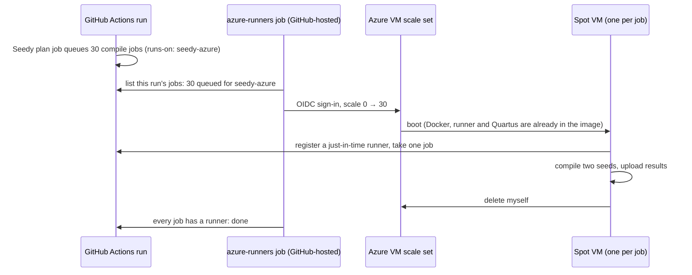

# Seedy on Azure spot VMs

Run Seedy's compile jobs on Azure spot VMs that exist only while there is work. A 30-seed comparison
(60 compiles) finishes in about **30 minutes** on 30 VMs, for about **$1 of spot compute**. With nothing to
do, the setup costs about a dollar a month, for the stored VM image.

This is the same idea as a self-hosted runner, without a machine to keep running. Nothing in it is specific
to Quartus. Any long-running job can fan out this way: give the job `runs-on: [self-hosted, seedy-azure]`
and add the `azure-runners` job beside it.

## How it works



* **`terraform/`** creates a VM scale set (Flexible orchestration, spot, ephemeral OS disks) at **zero
  instances**, the identities and least-privilege roles, a Key Vault for the GitHub credential and an image
  gallery.
* **`packer/`** bakes Ubuntu 24.04, Docker, the Actions runner and the Quartus image into the gallery, so a
  VM picks up its job within a few minutes of the scale-up, without pulling the multi-GB Quartus image.
* **`.github/workflows/azure-runners.yml`** is a reusable workflow. It signs in to Azure with GitHub's OIDC
  token, so Azure holds no secret, and adds one VM per queued job, up to `max_instances`. It adds more if jobs
  are still queued 8 minutes later (a VM was evicted or failed to start). It never removes VMs.
* **`vm/`** holds the scripts each VM runs. A VM registers a **just-in-time runner** for exactly one job,
  using a GitHub credential that it reads from Key Vault with its managed identity. After the job it deletes
  itself. A VM that gets no job within 10 minutes deletes itself as well, and a 12-hour watchdog is the last
  resort.

Nothing scales down, so nothing can scale down too early. Every VM removes itself.

## Cost

The estimates below are for East US list prices in October 2026, with `Standard_D8ads_v5` (8 vCPU, 32 GB:
two compiles at once with Seedy's defaults), `shards: 15` (30 VMs) and about 25 minutes per VM. That covers
boot, two compiles of about 17 minutes each running side by side, and the uploads.

| | per 30-seed comparison | wall time |
|---|---|---|
| Spot (~$0.087/h per VM) | **~$1.10** | ~30 min |
| Regular VMs (`spot = false`, ~$0.41/h) | ~$5.20 | ~30 min |
| Baseline already cached (PR runs after a push to master) | half of the above | same |
| GitHub-hosted runners, public repo | $0 | ~45 min+ |

On top of that:

* **Per run:** about $0.06 for the VMs' public IPs.
* **Monthly:** about $1 to store the image. Key Vault costs a few cents per 10,000 reads.
* **Private repos:** GitHub charges $0.002 per runner-minute on self-hosted runners in private repos, which
  comes to about $1.50 per comparison. Public repos don't pay it.

Spot prices change and vary by region. Check yours on the
[Linux VM pricing page](https://azure.microsoft.com/pricing/details/virtual-machines/linux/).

## What you need

* An Azure subscription where you are **Owner**, or Contributor plus User Access Administrator: Terraform
  creates role assignments and two custom roles.
* The [Azure CLI](https://learn.microsoft.com/cli/azure/install-azure-cli) (`az login`),
  [Terraform](https://developer.hashicorp.com/terraform/install) 1.6 or newer, and
  [Packer](https://developer.hashicorp.com/packer/install) for the image (optional but recommended).
* Admin rights on the core repository (or organization), to create the runner credential.
* **vCPU quota.** 30 × D8ads_v5 is 240 vCPUs. Spot VMs draw on the subscription's *Spot* vCPU quota in the
  region, regular VMs on the *DASv5* family quota. New subscriptions start far lower. Request an increase
  under **Quotas → Compute** in the portal (search "spot"); small increases are usually granted in minutes.
  If you get less, lower `max_instances` and `shards` to match.

## Setup

### 1. A GitHub credential for registering runners

VMs use the credential only to create a one-job registration for themselves. Pick one:

* **Fine-grained personal access token** (simplest): Settings → Developer settings → Fine-grained tokens.
  Under *Repository access*, select only the core repository. Under *Repository permissions*, set
  **Administration: Read and write**.
* **GitHub App** (better for organizations; it doesn't expire with you): create an app with
  **Repository permissions → Administration: Read and write** (or **Organization permissions →
  Self-hosted runners: Read and write** for an organization scope), no webhook, and install it on the
  repository. Note the App ID and download a private key.

### 2. Deploy the infrastructure

```sh
cd cloud/azure/terraform
cp terraform.tfvars.example terraform.tfvars   # set subscription_id and github_scope (and github_app_id for an app)
az login
terraform init
terraform apply
```

### 3. Store the credential in Key Vault

```sh
KV=$(terraform output -raw key_vault_name)
az keyvault secret set --vault-name "$KV" --name github-pat --file token.txt               # a PAT
az keyvault secret set --vault-name "$KV" --name github-app-private-key --file app.pem     # or an app's key
```

`--file` keeps the secret out of your shell history. Terraform never sees it.

### 4. Bake the image (recommended)

```sh
cd ../packer
packer init .
packer build $(terraform -chdir=../terraform output -raw packer_vars) seedy-runner.pkr.hcl
cd ../terraform
terraform apply -var use_gallery_image=true   # or set it in terraform.tfvars
```

The build takes about 15 minutes. Rebuild every month or two for OS and runner updates. The scale set uses
the newest image version for every VM it creates, with no Terraform change needed. The default image holds
Quartus 17.0.2. To bake in other versions, add their `tag@digest` references from
`.github/workflows/seedy.yml` to `prepull_images`.

You can skip this step. VMs then boot stock Ubuntu and install everything themselves, which takes a few
minutes longer per VM, and every VM pulls the Quartus image from Docker Hub. Each VM has its own IP, and
Docker Hub's anonymous limit counts pulls per IP, so that is fine for one pull per VM.

### 5. Tell the repository about it

```sh
gh variable set SEEDY_AZURE_VMSS_ID   --body "$(terraform output -raw vmss_id)"
gh variable set SEEDY_AZURE_CLIENT_ID --body "$(terraform output -raw scaler_client_id)"
gh variable set SEEDY_AZURE_TENANT_ID --body "$(terraform output -raw tenant_id)"
```

These are identifiers, not secrets. Azure trusts only workflow jobs in the repository's **`seedy-azure`
environment**. GitHub creates the environment on the first run. To control who can spend Azure money, open
**Settings → Environments → seedy-azure** and limit the branches that may use it, or require a reviewer.

### 6. Turn it on in the core's workflow

In `.github/workflows/seedy.yml` (from [templates/seedy.yml](../../templates/seedy.yml)), uncomment the
`azure-runners` job and set these in the `seedy` job:

```yaml
      runs_on: '["self-hosted", "seedy-azure"]'
      shards: 15                 # VMs per variant: 30 seeds -> 2 seeds per VM, compiled side by side
```

Keep `light_runs_on` on GitHub-hosted runners: the plan and report jobs are small. Fork PRs never reach
these VMs. Seedy refuses fork PRs on self-hosted runners, and the template skips `azure-runners` for them.

## Sizing

Seedy's `per_job_concurrency: auto` runs as many compiles as fit in both CPUs
(`threads_per_compile`, 4 by default) and RAM (about 7 GB each):

| VM size | vCPU / RAM | compiles per VM | VMs for 30 seeds × 2 variants | `shards` |
|---|---|---|---|---|
| `Standard_D8ads_v5` (default) | 8 / 32 GB | 2 | 30 | 15 |
| `Standard_D16ads_v5` | 16 / 64 GB | 4 | 16 | 8 |
| `Standard_D4ads_v5` | 4 / 16 GB | 1 | 60 | 30 |

Fewer, bigger VMs mean fewer boots, but each eviction loses more seeds. The VM size needs a local temp disk
(the `d` in `ads`) for the ephemeral OS disk. Use `ephemeral_os_disk = false` for other sizes.

`vm_sizes` takes up to five sizes for an instance mix. Azure then picks whichever has spot capacity
(`instance_mix_strategy`). Compile *times* get noisier across sizes, but fitter results don't change, since
`threads_per_compile` stays fixed.

## Day to day

* **Watch it:** the `azure-runners` job's log shows each scale-up. In the portal, the scale set's
  **Instances** blade shows the VMs. **Boot diagnostics → Serial log** on a VM shows what its agent did.
* **Spot evictions:** an evicted VM takes its job down with it. Seedy reports the lost seeds, and the
  comparison fails rather than counting them. Use **Re-run all jobs**. *Re-run failed jobs* doesn't re-run
  `azure-runners`, so the re-run compiles would wait for VMs that never come. If you only want the failed
  ones, re-run them and add VMs by hand:
  `az vmss scale -g rg-seedy-runners -n seedy-runners --new-capacity <VMs running + jobs waiting>`.
  Idle VMs remove themselves after 10 minutes.
* **Tear it all down:** `terraform destroy`. Any VMs still running go with the scale set.

## Security

* **Who can spend:** jobs in the `seedy-azure` environment of the repositories in `scaler_repositories`.
  Anyone who can push a branch to the repository can trigger such a job, because a same-repo PR runs its own
  copy of the workflow. Use environment protection rules if that matters to you.
* **What the scaler can do:** change the scale set and create or delete VMs in this one resource group,
  through a custom role. It holds no other Azure rights and no GitHub credential.
* **What a VM can do:** read the GitHub credential from Key Vault and delete VMs in this resource group.
  Job steps run as `runner`, Quartus runs in Docker, and both are firewalled from the managed-identity
  endpoint. `runner` is in the `docker` group, though, so treat that firewall as defence in depth. **Run
  only code you would run on your own machine**, which is Seedy's rule for any self-hosted runner. A fresh
  VM per job (`max_jobs_per_vm = 1`) means one job can't tamper with the next.
* **No inbound access:** the network security group admits nothing from the internet. Each VM has a public
  IP for outbound traffic only.

## Other recipes

* [fortytwoservices/terraform-azurerm-selfhostedrunnervmss](https://github.com/fortytwoservices/terraform-azurerm-selfhostedrunnervmss)
  deploys a VM scale set for runners, and leaves registering and scaling to an external service. This
  setup does both itself.
* [actions-runner-controller](https://github.com/actions/actions-runner-controller) on AKS also scales to
  zero runners. The AKS system node pool, though, can't scale to zero or use spot. Seedy also needs Docker
  inside the runner, and in ARC's Docker-in-Docker mode every pod pulls the multi-GB Quartus image again.
* [terraform-aws-github-runner](https://github.com/github-aws-runners/terraform-aws-github-runner) is the
  mature version of this pattern on AWS. It is webhook-driven, with spot instances and scale-to-zero.
