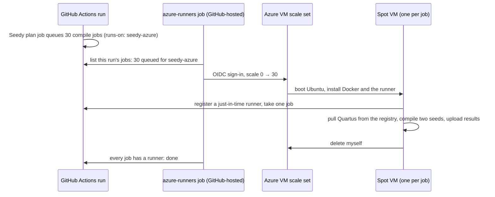

# Seedy on Azure spot VMs (optional)

Run Seedy's compile jobs on Azure spot VMs that exist only while there is work. A 30-seed comparison
(60 compiles) finishes in about **30 minutes** on 30 VMs, for about **$1.20 of spot compute**. With nothing
to do, the setup costs about $5 a month, for the container registry that holds the Quartus image.

You don't need this to use Seedy. Seedy's workflow runs the same way on all three kinds of runner:

| runner | caller sets | Quartus image comes from |
|---|---|---|
| GitHub-hosted (default) | nothing | Docker Hub |
| your own machine (see *Self-hosted runners* in the [README](../../README.md)) | `runs_on: '["self-hosted", "linux", "quartus"]'` | the machine's Docker, or a mirror named in `SEEDY_IMAGE_MIRROR` |
| this scale set | `runs_on: '["self-hosted", "seedy-azure"]'` | this deployment's registry |

Everything here is deployed by hand: Terraform files and the steps below. Nothing in it is specific to
Quartus. Any long-running job can fan out this way, with `runs-on: [self-hosted, seedy-azure]`.

## How it works



* **`terraform/`** creates:
  * a VM scale set (Flexible orchestration, spot, ephemeral OS disks) at **zero instances**;
  * the identities and least-privilege roles;
  * a Key Vault for the GitHub credential;
  * a **container registry** for local copies of the Quartus image(s), so VMs never pull from Docker Hub.
* **`vm/`** holds what each VM runs at boot. Through cloud-init, a VM installs Docker and the Actions runner,
  then registers a **just-in-time runner** for exactly one job. It uses a GitHub credential that it reads
  from Key Vault with its managed identity. It logs the runner in to the registry and hands jobs the
  registry's address as `SEEDY_IMAGE_MIRROR`. After the job it deletes itself. A VM that gets no job within
  10 minutes deletes itself as well, and a 12-hour watchdog is the last resort.
* **Starting VMs** happens in one of two ways:
  * **On demand:** [`azure-runners.yml`](../../.github/workflows/azure-runners.yml) is a reusable workflow
    that the caller runs beside Seedy. It signs in to Azure with GitHub's OIDC token, so no Azure secret is
    stored anywhere, and adds one VM per queued job, up to `max_instances`. It adds more for jobs still
    queued 8 minutes later (a VM was evicted or failed to start).
  * **By hand:** run `az vmss scale` yourself before starting a run (see [Day to day](#day-to-day)).

Nothing scales down, so nothing can scale down too early. Every VM removes itself.

## Cost

The estimates below are for East US list prices in October 2026, with `Standard_D8ads_v5` (8 vCPU, 32 GB:
two compiles at once with Seedy's defaults), `shards: 15` (30 VMs) and about 28 minutes per VM. That covers
boot and setup, the image pull, two compiles of about 17 minutes each running side by side, and the uploads.

| | per 30-seed comparison | wall time |
|---|---|---|
| Spot (~$0.087/h per VM) | **~$1.20** | ~30 min |
| Regular VMs (`spot = false`, ~$0.41/h) | ~$5.80 | ~30 min |
| Baseline already cached (PR runs after a push to master) | half of the above | same |
| GitHub-hosted runners, public repo | $0 | ~45 min+ |

On top of that:

* **Per run:** about $0.06 for the VMs' public IPs.
* **Monthly:** about $5 for the Basic registry (10 GB included, about two Quartus versions), or about $20
  for Standard. Key Vault costs a few cents per 10,000 reads. With `registry = false` the idle cost is
  zero, and VMs pull from Docker Hub instead.
* **Private repos:** GitHub charges $0.002 per runner-minute on self-hosted runners in private repos, which
  comes to about $1.50 per comparison. Public repos don't pay it.

Spot prices change and vary by region. Check yours on the
[Linux VM pricing page](https://azure.microsoft.com/pricing/details/virtual-machines/linux/).

## What you need

* An Azure subscription where you are **Owner**, or Contributor plus User Access Administrator: Terraform
  creates role assignments and two custom roles.
* The [Azure CLI](https://learn.microsoft.com/cli/azure/install-azure-cli) (`az login`) and
  [Terraform](https://developer.hashicorp.com/terraform/install) 1.6 or newer.
* Admin rights on the core repository (or organization), to create the runner credential.
* **vCPU quota.** 30 × D8ads_v5 is 240 vCPUs. Spot VMs draw on the subscription's *Spot* vCPU quota in the
  region, regular VMs on the *DASv5* family quota. New subscriptions start far lower. Request an increase
  under **Quotas → Compute** in the portal (search "spot"); small increases are usually granted in minutes.
  If you get less, lower `max_instances` and `shards` to match.

## Setup

### 1. A GitHub credential for registering runners

VMs use the credential only to create a one-job registration for themselves. Pick one:

* **Fine-grained personal access token** (simplest): Settings → Developer settings → Fine-grained tokens.
  Under *Repository access*, select only the core repository. Under *Repository permissions*, set
  **Administration: Read and write**.
* **GitHub App** (better for organizations; it doesn't expire with you): create an app with
  **Repository permissions → Administration: Read and write** (or **Organization permissions →
  Self-hosted runners: Read and write** for an organization scope), no webhook, and install it on the
  repository. Note the App ID and download a private key.

### 2. Deploy

```sh
cd cloud/azure/terraform
cp terraform.tfvars.example terraform.tfvars   # set subscription_id and github_scope (and github_app_id for an app)
az login
terraform init
terraform apply
```

### 3. Store the credential in Key Vault

```sh
KV=$(terraform output -raw key_vault_name)
az keyvault secret set --vault-name "$KV" --name github-pat --file token.txt               # a PAT
az keyvault secret set --vault-name "$KV" --name github-app-private-key --file app.pem     # or an app's key
```

`--file` keeps the secret out of your shell history. Terraform never sees it.

### 4. Copy the Quartus image into the registry

```sh
ACR=$(terraform output -raw registry_name)
az acr import --name "$ACR" --image theypsilon/quartus-lite-c5:17.0.2 \
  --source docker.io/theypsilon/quartus-lite-c5@sha256:42e6c06da3af486f9cfea74acb5c1af9b63a77d0f16e3bf093215216e209b7ad
```

Azure copies the image server-side, once, and keeps its digest, so it is the same image Seedy pins. For the
other Quartus versions, take the digest from the `case "$QV"` list in
[`.github/workflows/seedy.yml`](../../.github/workflows/seedy.yml) and change the tag to match. If Docker
Hub turns the import away for its anonymous limit, add `--username` and `--password` (a Docker Hub access
token).

If a version isn't in the registry, jobs log a warning and pull it from Docker Hub instead.

### 5. Tell the repository about it

Only needed for on-demand scaling:

```sh
gh variable set SEEDY_AZURE_VMSS_ID   --body "$(terraform output -raw vmss_id)"
gh variable set SEEDY_AZURE_CLIENT_ID --body "$(terraform output -raw scaler_client_id)"
gh variable set SEEDY_AZURE_TENANT_ID --body "$(terraform output -raw tenant_id)"
```

These are identifiers, not secrets. Azure trusts only workflow jobs in the repository's **`seedy-azure`
environment**. GitHub creates the environment on the first run. To control who can spend Azure money, open
**Settings → Environments → seedy-azure** and limit the branches that may use it, or require a reviewer.

### 6. Point the core's workflow at it

In `.github/workflows/seedy.yml` (from [templates/seedy.yml](../../templates/seedy.yml)), set these in the
`seedy` job:

```yaml
      runs_on: '["self-hosted", "seedy-azure"]'
      shards: 15                 # VMs per variant: 30 seeds -> 2 seeds per VM, compiled side by side
```

For on-demand scaling, also uncomment the `azure-runners` job. Keep `light_runs_on` on GitHub-hosted
runners: the plan and report jobs are small. Fork PRs never reach these VMs. Seedy refuses fork PRs on
self-hosted runners, and the template skips `azure-runners` for them.

## Sizing

Seedy's `per_job_concurrency: auto` runs as many compiles as fit in both CPUs
(`threads_per_compile`, 4 by default) and RAM (about 7 GB each):

| VM size | vCPU / RAM | compiles per VM | VMs for 30 seeds × 2 variants | `shards` |
|---|---|---|---|---|
| `Standard_D8ads_v5` (default) | 8 / 32 GB | 2 | 30 | 15 |
| `Standard_D16ads_v5` | 16 / 64 GB | 4 | 16 | 8 |
| `Standard_D4ads_v5` | 4 / 16 GB | 1 | 60 | 30 |

Fewer, bigger VMs mean fewer boots and image pulls, but each eviction loses more seeds. The VM size needs a
local temp disk (the `d` in `ads`) for the ephemeral OS disk. Use `ephemeral_os_disk = false` for other
sizes.

`vm_sizes` takes up to five sizes for an instance mix. Azure then picks whichever has spot capacity
(`instance_mix_strategy`). Compile *times* get noisier across sizes, but fitter results don't change, since
`threads_per_compile` stays fixed.

Basic registries have the lowest pull throughput. If 30 VMs pulling at once is slow, set
`registry_sku = "Standard"`.

## Day to day

* **Starting VMs by hand** (without `azure-runners`):
  `az vmss scale -g rg-seedy-runners -n seedy-runners --new-capacity 30`, then start the run. Each VM
  takes one job, and any VM that gets none deletes itself after `idle_minutes` (10 by default).
* **Watch it:** the `azure-runners` job's log shows each scale-up. In the portal, the scale set's
  **Instances** blade shows the VMs. **Boot diagnostics → Serial log** on a VM shows what its agent did.
* **Spot evictions:** an evicted VM takes its job down with it. Seedy reports the lost seeds, and the
  comparison fails rather than counting them. Use **Re-run all jobs**. *Re-run failed jobs* doesn't re-run
  `azure-runners`, so the re-run compiles would wait for VMs that never come. If you only want the failed
  ones, re-run them and add VMs by hand:
  `az vmss scale -g rg-seedy-runners -n seedy-runners --new-capacity <VMs running + jobs waiting>`.
* **Updates:** VMs install the latest Ubuntu packages and Actions runner at every boot, so there is no image
  to maintain.
* **Tear it all down:** `terraform destroy`. Any VMs still running go with the scale set.

## Security

* **Who can spend:** jobs in the `seedy-azure` environment of the repositories in `scaler_repositories`.
  Anyone who can push a branch to the repository can trigger such a job, because a same-repo PR runs its own
  copy of the workflow. Use environment protection rules if that matters to you.
* **What the scaler can do:** change the scale set and create or delete VMs in this one resource group,
  through a custom role. It holds no other Azure rights and no GitHub credential.
* **What a VM can do:** read the GitHub credential from Key Vault, pull from the registry, and delete VMs
  in this resource group. Job steps run as `runner`, Quartus runs in Docker, and both are firewalled from
  the managed-identity endpoint. `runner` is in the `docker` group, though, so treat that firewall as
  defence in depth. **Run only code you would run on your own machine**, which is Seedy's rule for any
  self-hosted runner. A fresh VM per job (`max_jobs_per_vm = 1`) means one job can't tamper with the next.
* **No inbound access:** the network security group admits nothing from the internet. Each VM has a public
  IP for outbound traffic only.

## Other recipes

* [fortytwoservices/terraform-azurerm-selfhostedrunnervmss](https://github.com/fortytwoservices/terraform-azurerm-selfhostedrunnervmss)
  deploys a VM scale set for runners, and leaves registering and scaling to an external service. This
  setup does both itself.
* [actions-runner-controller](https://github.com/actions/actions-runner-controller) on AKS also scales to
  zero runners. The AKS system node pool, though, can't scale to zero or use spot. Seedy also needs Docker
  inside the runner, and in ARC's Docker-in-Docker mode every pod pulls the multi-GB Quartus image again.
* [terraform-aws-github-runner](https://github.com/github-aws-runners/terraform-aws-github-runner) is the
  mature version of this pattern on AWS. It is webhook-driven, with spot instances and scale-to-zero.
